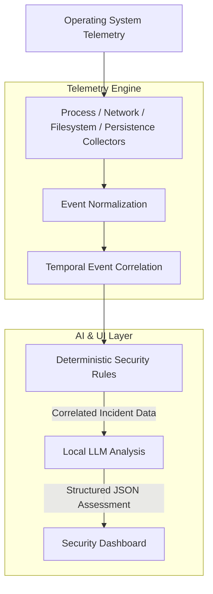

# 🛡️ Local Cyber Guardian


> **Local Cyber Guardian** is an offline, AI-powered endpoint security prototype designed for Linux and Windows 11 ARM64 systems.  
> It continuously monitors system activity to detect suspicious behavior, then leverages a locally running Large Language Model (LLM) as an automated security analyst—evaluating the incident and explaining the behavior through a native desktop dashboard.
> 
> *Disclaimer: This project is a proof-of-concept prototype. It is not a full antivirus replacement, and suspicious behavior flagged by the system does not necessarily indicate malware.*

---

## 💡 Why this project exists

Modern endpoint security tools often rely on cloud telemetry, uploading process lists, network activity, and file hashes to external servers. This project explores the feasibility of an entirely **local, private, and always-on** security analyst. By bringing the LLM to the edge, we can provide deep, explainable security assessments without sacrificing user privacy or requiring an internet connection.

---

## ✨ Feature Overview

- **Process Monitoring:** Tracks executable paths, parent-child relationships, and command-line arguments.
- **Network Monitoring:** Detects newly opened listening ports and outbound connections.
- **Filesystem Integrity:** Uses event-driven monitoring (`watchdog`) to spot new executables dropped in vulnerable directories (e.g., `/tmp`).
- **Persistence Monitoring:** Detects modifications to `.bashrc`, `crontabs`, and `systemd` configurations.
- **Temporal Correlation Engine:** Links suspicious process execution with subsequent network or filesystem activity occurring in the same time window.
- **Offline AI Analyst:** Dual-backend support! Runs locally via a lightweight `Llama 3.2` model on CPU/GPU, or seamlessly offloads inference to the **Qualcomm Snapdragon NPU** using `GenieAPIService` (Qwen3-4B).
- **Native Desktop Dashboard:** A modern UI displaying the system status, correlated kill-chains, and AI evidence/benign explanations.

---

## 🛠️ Architecture



### 🔍 How Detection Works

1. **Telemetry Collection:** Raw signals are collected via `psutil` (for processes and network) and `watchdog` (for filesystem/persistence events).
2. **Normalization:** Raw data is converted into standardized `Event` objects.
3. **Correlation:** A rolling buffer temporally correlates events. If a suspicious process is spawned, any subsequent network listeners or persistence modifications within the window are linked to it.
4. **Deterministic Trigger:** If a recognized chain is formed, an `Incident` is generated and sent to the UI immediately.

### 🧠 AI Analysis Workflow

Once an incident is triggered, the AI analyst takes over:
1. The incident's related events are compiled into a compact chronological timeline.
2. The timeline is fed to a locally hosted Llama model (or Snapdragon NPU) with a strict system prompt.
3. The model returns a structured JSON payload containing the `severity`, `confidence`, `evidence`, `benign_explanation`, and a `recommended_action`.
4. If the model hallucinates formatting, an auto-retry mechanism prompts it to correct the JSON.
5. The dashboard is dynamically updated with the AI's explanation and benchmark metrics.

---

## 📁 Repository Structure

```text
Local-Cyber-Guardian/
├── download_model.py                <-- Script to fetch the GGUF model
├── requirements.txt                 <-- Python dependencies
├── simulate.py                      <-- Simple malicious chain simulation
├── test_scenarios.py                <-- Comprehensive test suite (Benign & Suspicious)
└── security_guardian/
    ├── main.py                      <-- Orchestrator and entry point
    ├── ai/
    │   ├── interface.py             <-- Abstract base class for AI Analyzers
    │   ├── local_llm.py             <-- Llama-cpp implementation (CPU/GPU)
    │   └── npu_llm.py               <-- Qualcomm Snapdragon NPU implementation
    ├── collectors/                  <-- psutil and watchdog telemetry collectors
    ├── detection/                   <-- Correlation buffer and deterministic rules
    ├── events/                      <-- Dataclass models and normalization
    └── ui/                          <-- CustomTkinter desktop dashboard
```

---

## ⚡ Performance & Inference Backends

| Inference Backend | Hardware | Supported Model | Power Efficiency |
|---|---|---|---|
| **`local_llm`** (Default) | Standard CPU / GPU | Llama-3.2-1B-Instruct | High (Standard Compute) |
| **`qualcomm_npu`** | Snapdragon X Elite / Plus | Qwen3-4B | Ultra-Low (NPU Offload) |

---

## 🚀 Setup & Installation

### Prerequisites

- **OS:** Linux (Tested on Arch Linux) or **Windows 11 ARM64** (For Snapdragon NPU)
- **Python:** 3.10+
- **Hardware:** CPU/GPU capable of running a 1B model, OR a **Qualcomm Snapdragon X-series** device.

1. Clone the repository and navigate to the project root:
   ```bash
   cd "Local Cyber Guardian"
   ```

2. Create and activate a Python virtual environment:
   ```bash
   python -m venv venv
   source venv/bin/activate
   ```

3. Install the dependencies:
   ```bash
   pip install -r requirements.txt
   ```

### 🦙 Setup the Local LLM (Linux / CPU / GPU)

The script fetches the quantized `Llama-3.2-1B-Instruct-Q4_K_M.gguf` model from HuggingFace and places it in the `models/` directory.

```bash
python download_model.py
```

### 📱 Setup the Local LLM (Windows 11 ARM64 / Snapdragon NPU)

To offload inference entirely to the NPU on a Snapdragon laptop:

1. Install the **Qualcomm Genie SDK**.
2. Deploy a Qualcomm-supported model (e.g., `Qwen3-4B` pre-converted for NPU).
3. Start the **GenieAPIService**. By default, it exposes an OpenAI-compatible local API on `localhost:8910`. Ensure the service configuration has `"device": "npu"`.
4. Ensure `python` and `requests` are installed in your Windows environment.

---

## 💻 Running the Application

To start the telemetry engine, AI analyst, and desktop dashboard, run the main module.

**For CPU/GPU (Default):**
```bash
python -m security_guardian.main
```

**For Snapdragon NPU:**
```bash
python -m security_guardian.main --ai-backend qualcomm_npu
```

> **Note:** The dashboard will launch in a native graphical window.

---

## 🧪 Running the Test Scenarios

Leave the dashboard running in one terminal, open a **new** terminal, activate your virtual environment, and run:

```bash
python test_scenarios.py
```

You will be prompted to select a scenario (1-9). 
- **Scenarios 1-4** are benign. Watch how the system correctly ignores them.
- **Scenarios 5-9** are suspicious. Try **Scenario 9** to simulate a full kill-chain (a payload dropped in `/tmp` that establishes persistence and opens an outbound connection) and watch the AI analyst assess it in real-time.

---

## 📊 Example Output

**Structured JSON Assessment generated by the LLM:**
```json
{
  "severity": "HIGH",
  "confidence": 0.85,
  "assessment": "Suspicious behavior indicative of a potential backdoor or reverse shell installation.",
  "evidence": [
    "Executable launched from a temporary directory (/tmp).",
    "Process created a persistent systemd service.",
    "Process immediately opened a network listener on port 4445."
  ],
  "benign_explanation": [
    "A developer actively testing a local daemon or server script."
  ],
  "recommended_action": "INVESTIGATE"
}
```

---

## 📌 Current Status

- ✅ CPU/GPU local inference using `llama.cpp` is complete and functional.
- ✅ **Qualcomm Snapdragon NPU Integration** via `GenieAPIService` is complete, allowing drop-in replacement of the inference backend on Windows 11 ARM64.
- ✅ Process, network, filesystem, and persistence telemetry are implemented.
- ✅ Dashboard modernization, correlation engines, and strict JSON outputs are verified.

---

## 📜 License

[MIT License](LICENSE)
